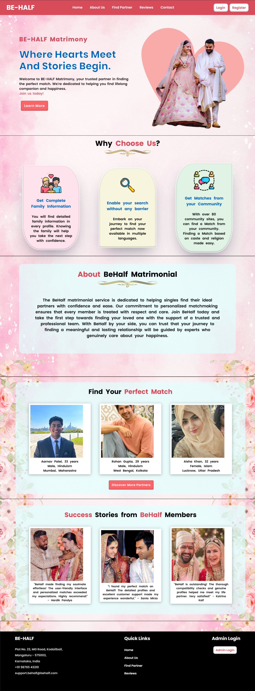
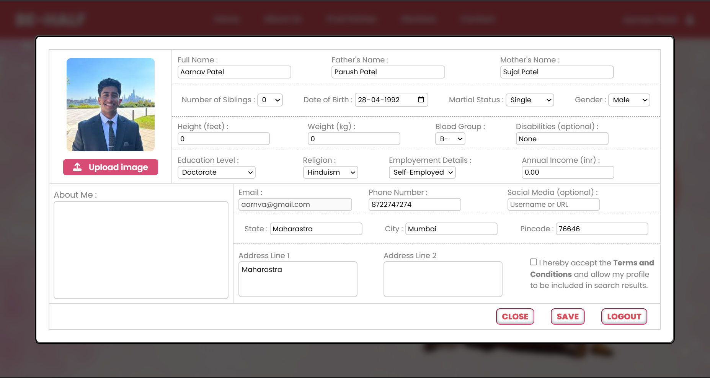
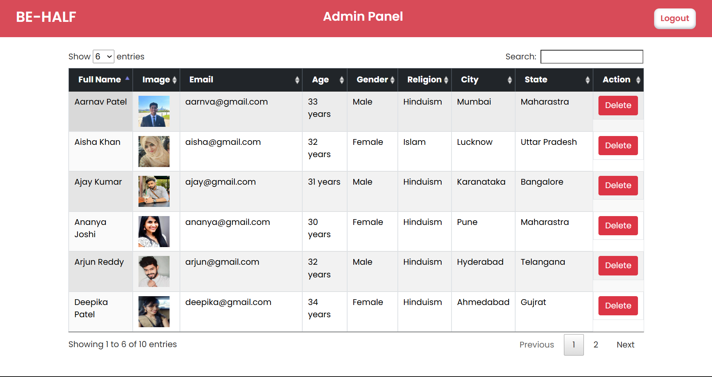
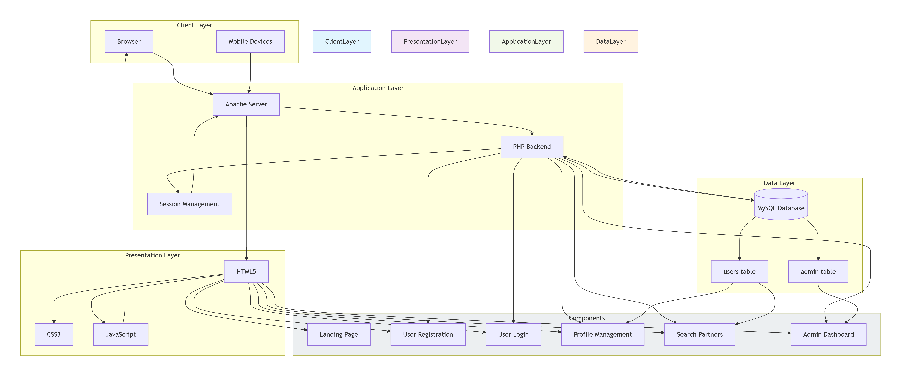

# BE-HALF - Matrimonial Platform

A comprehensive web-based matrimonial platform that connects individuals seeking life partners. BE-HALF streamlines the matchmaking process by providing advanced search filters, detailed user profiles, and secure authentication mechanisms.

## Description

BE-HALF is a full-featured matrimony website designed to help individuals find compatible life partners. The platform addresses the challenge of finding suitable matches by providing a centralized system where users can create detailed profiles, search for potential partners based on various criteria, and connect with matches that align with their preferences.

**Target Audience:**
- Individuals seeking marriage partners
- Families looking for suitable matches for their relatives
- Matrimonial service providers and administrators

**Key Problem Solved:**
Traditional matchmaking processes are time-consuming and lack transparency. BE-HALF digitizes this process, making it efficient, accessible, and user-friendly while maintaining privacy and security standards.

## Screenshots


*landingpage with navigation and hero section*


*Detailed user profile with personal information*


*Advanced search functionality with multiple filters*


*Admin panel for managing users and platform*

## Features

- **User Registration & Authentication**
  - Secure user signup and login system
  - Session management with logout functionality
  - Password-protected user accounts

- **Comprehensive User Profiles**
  - Personal details (name, DOB, gender, height, weight)
  - Educational and employment information
  - Religious preferences and marital status
  - Profile photo upload functionality
  - Bio/About section for personalization
  - Medical information (blood group, disabilities)

- **Advanced Search & Filtering**
  - Search partners by multiple criteria
  - Filter by age, location, education, religion
  - Filter by marital status and employment
  - Real-time search results

- **Profile Management**
  - Edit and update profile information
  - Upload and manage profile pictures
  - View complete profile details

- **Admin Panel**
  - Secure admin authentication
  - User management dashboard
  - Platform administration tools
  - Monitor and moderate user profiles

- **Responsive Design**
  - Mobile-friendly interface
  - Cross-browser compatibility
  - Intuitive navigation system

- **Additional Features**
  - About Us page with platform information
  - Contact page for user inquiries
  - User reviews and testimonials section
  - Location-based matching (state, city, pincode)

## System Architecture

BE-HALF follows a traditional three-tier architecture:

### Frontend Layer
- HTML5 for structure and semantic markup
- CSS3 for styling with modular stylesheets for each page
- Vanilla JavaScript for client-side interactivity and form validation
- FontAwesome icons for enhanced UI/UX

### Backend Layer
- PHP for server-side logic and business rules
- Session management for user authentication
- File upload handling for profile images
- Form validation and data sanitization
- Modular application structure separating concerns

### Database Layer
- MySQL/MariaDB for relational data storage
- Two main tables: `admin` and `users`
- Secure connection handling with error management
- User data includes personal, educational, and contact information

### Data Flow
1. User interacts with the frontend interface
2. Forms submit data to PHP backend scripts
3. Backend validates and processes data
4. Database operations (CRUD) are performed
5. Results are fetched and displayed to users
6. Session state manages authenticated users


*High-level system architecture overview*

## Technology Stack

### Frontend
- **HTML5** - Semantic markup and structure
- **CSS3** - Styling and responsive design
- **JavaScript (ES6+)** - Client-side scripting and DOM manipulation
- **FontAwesome** - Icon library for UI elements

### Backend
- **PHP** - Server-side scripting language
- **MySQL/MariaDB** - Relational database management

### Development Tools
- **XAMPP** - Local development environment (Apache, MySQL, PHP)
- **phpMyAdmin** - Database administration interface

### Libraries & Frameworks
- **FontAwesome Kit** - Icon toolkit
- **mysqli** - MySQL improved extension for PHP

## Getting Started

### Prerequisites

Before running this project, ensure you have the following installed:

- **XAMPP** (v3.3.0 or higher) or any LAMP/WAMP stack
  - Apache Server
  - MySQL/MariaDB (v10.4 or higher)
  - PHP (v8.0 or higher)
- Web browser (Chrome, Firefox, Safari, or Edge)
- Text editor or IDE (VS Code, Sublime Text, or PHPStorm)

### Installation Steps

1. **Clone or Download the Repository**
   ```bash
   git clone https://github.com/adithya-b-r/matrimony-platform.git
   ```
   Or download as ZIP and extract it.

2. **Move Project to XAMPP htdocs**
   ```bash
   # Move the matrimony folder to XAMPP's htdocs directory
   # Windows: C:\xampp\htdocs\matrimony
   # Linux: /opt/lampp/htdocs/matrimony
   # macOS: /Applications/XAMPP/htdocs/matrimony
   ```

3. **Start XAMPP Services**
   - Open XAMPP Control Panel
   - Start **Apache** and **MySQL** services
   - Verify both services are running (green indicators)

4. **Create Database**
   - Open your browser and navigate to `http://localhost/phpmyadmin`
   - Create a new database named `behalf`
   - Click on the **Import** tab
   - Select the SQL file: `database/behalf.sql`
   - Click **Go** to import the database structure and sample data

5. **Configure Database Connection** (Optional)
   
   If you have custom database credentials, update the configuration:
   ```bash
   # Edit application/config.php
   ```
   
   ```php
   $db_host = 'localhost'; 
   $db_username = 'root';
   $db_password = ''; // Add your MySQL password if set
   $db_name = 'behalf';
   ```

6. **Access the Application**
   
   Open your browser and navigate to:
   ```
   http://localhost/matrimony
   ```

7. **Admin Panel Access**
   
   Navigate to the admin panel:
   ```
   http://localhost/matrimony/adminpanel
   ```
   
   **Default Admin Credentials:**
   - Username: `admin`
   - Password: `admin123`

8. **Test User Accounts**
   
   Sample user credentials (from imported data):
   - Email: `ananya@gmail.com` | Password: `1234`
   - Email: `vikram@gmail.com` | Password: `1234`

### Running the Project Locally

Once setup is complete:

```bash
# Ensure XAMPP Apache and MySQL are running
# Navigate to http://localhost/matrimony in your browser
```

**Common Commands:**

```bash
# Start XAMPP (Linux/macOS)
sudo /opt/lampp/lampp start

# Stop XAMPP (Linux/macOS)
sudo /opt/lampp/lampp stop

# Restart Apache (Linux/macOS)
sudo /opt/lampp/lampp reloadapache
```

## Security & Privacy

### Authentication & Authorization
- Session-based authentication for user and admin access
- Password protection for all user accounts
- Separate admin panel with dedicated authentication
- Logout functionality to terminate sessions securely

### Data Protection
- Server-side validation for all form inputs
- MySQLi prepared statements recommended (to prevent SQL injection)
- Secure file upload handling for profile images
- Session management prevents unauthorized access

### Environment Variables
While the current implementation uses direct configuration, it's recommended to use environment variables in production:

```php
// Recommended: Use environment variables
$db_host = getenv('DB_HOST') ?: 'localhost';
$db_username = getenv('DB_USER') ?: 'root';
$db_password = getenv('DB_PASS') ?: '';
$db_name = getenv('DB_NAME') ?: 'behalf';
```

### Security Best Practices Followed
- Session hijacking prevention through session regeneration
- File upload validation (image format verification)
- Error handling without exposing sensitive information
- Database connection error management

### Recommended Security Enhancements
- Implement password hashing (bcrypt or Argon2)
- Add CSRF token protection for forms
- Enable HTTPS in production
- Implement rate limiting for login attempts
- Add input sanitization and output encoding

## Future Enhancements

### Planned Features
- **Advanced Matching Algorithm** - AI-based compatibility scoring
- **Real-time Chat System** - Enable direct communication between matched users
- **Email Notifications** - Send alerts for new matches and profile views
- **Premium Membership** - Subscription-based features for advanced users
- **Video Call Integration** - Virtual meetings before in-person interactions
- **Mobile Application** - Native Android and iOS apps
- **Multi-language Support** - Regional language options
- **Social Media Integration** - Login with Google, Facebook
- **Verified Profiles** - Badge system for authenticated users
- **Privacy Controls** - Granular visibility settings for profile information

### Scalability Improvements
- Migrate to MVC framework (Laravel or CodeIgniter)
- Implement RESTful API architecture
- Add Redis caching for frequently accessed data
- Database optimization with indexing and query optimization
- CDN integration for media files
- Load balancing for high traffic handling

### Performance Upgrades
- Implement lazy loading for images
- Minify CSS and JavaScript files
- Enable GZIP compression
- Optimize database queries
- Implement pagination for search results
- Add service workers for offline functionality

### UX Enhancements
- Interactive onboarding tutorial for new users
- Advanced filter options with save functionality
- Profile completion progress indicator
- Dark mode theme
- Accessibility improvements (WCAG compliance)
- Better mobile responsiveness

## License

This project is licensed under the **MIT License**.

See the [LICENSE](LICENSE) file for more details.

## Author

**Adithya B R**

- GitHub: [@adithya-b-r](https://github.com/adithya-b-r)
- LinkedIn: [adithya-br](https://www.linkedin.com/in/adithya-br)
- Project Repository: [https://github.com/adithya-b-r/matrimony-platform](https://github.com/adithya-b-r/matrimony-platform)

## Acknowledgements

- **FontAwesome** - For providing beautiful icons
- **XAMPP** - For the local development environment
- **phpMyAdmin** - For database management interface
- **Mozilla Developer Network (MDN)** - For web development documentation
- **Stack Overflow Community** - For troubleshooting and best practices
- **PHP Documentation** - For comprehensive language reference

---

**Note:** This is an educational project demonstrating full-stack web development concepts. For production deployment, additional security measures and optimizations are strongly recommended.

If you find this project helpful, please consider giving it a star ⭐ on GitHub!